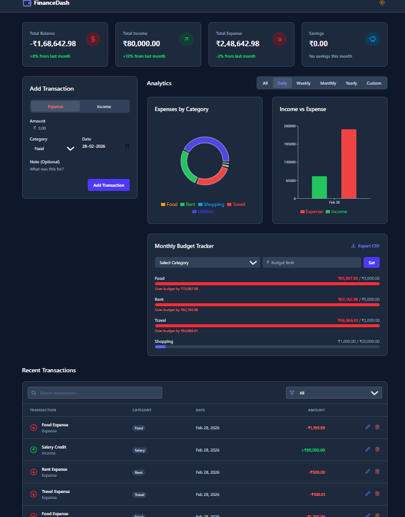

# 💰 Personal Finance Dashboard

> A modern, fully client-side finance tracker built with React and Tailwind CSS.

🔗 **[Live Demo](https://your-vercel-link.vercel.app)** | 👨‍💻 **[Portfolio](https://rishab1370.github.io/My-Portfolio/)**



## ✨ Features

- **Summary Cards** — Real-time tracking of Income, Expense, Savings, and Net Balance
- **Transaction Management** — Add, edit, delete, and filter transactions by category
- **Data Visualization** — Interactive Donut and Bar charts powered by Recharts
- **Budget Tracker** — Set monthly limits per category with live progress tracking
- **Dark / Light Mode** — Full theme switching with Tailwind CSS
- **CSV Export** — Download all transactions in one click
- **Persistent Storage** — All data saved in browser via localStorage

## 🛠️ Tech Stack

| Category   | Technology                  |
|------------|-----------------------------|
| Framework  | React 18 + Vite             |
| Styling    | Tailwind CSS                |
| Charts     | Recharts                    |
| Icons      | Lucide React                |
| Utils      | date-fns, uuid              |
| Deployment | Vercel                      |

## 🚀 Getting Started
```bash
git clone https://github.com/rishab1370/finance-dashboard.git
cd finance-dashboard
npm install
npm run dev
```

## 📦 Deployment

Deployed on Vercel with automatic deployments on every push to main.

---
Built by [Rishabh Tiwari](https://rishab1370.github.io/My-Portfolio/)